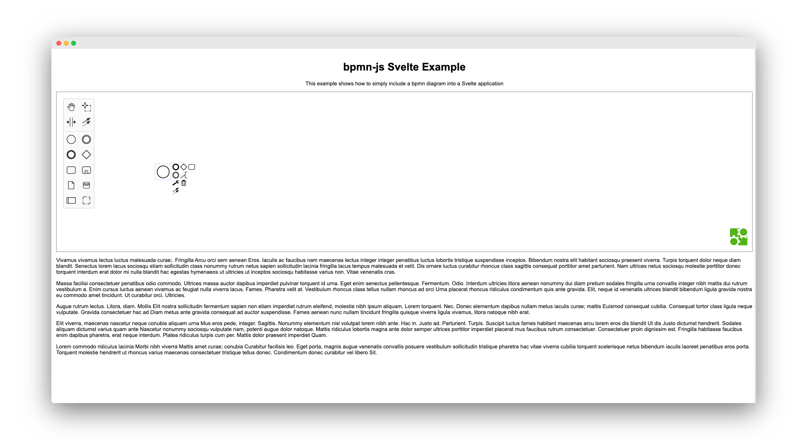

# bpmn-js-svelte-example

An example how to integrate bpmn-js with a [Svelte](https://svelte.dev/) application.



## Prerequisites

To install all project dependencies execute

```sh
npm install
```


## Integrating bpmn-js

Integrating bpmn-js is as easy as creating a Svelte component similar to [`Diagram`](./src/components/Diagram.svelte):

```js
<script>
  import { onMount } from 'svelte';

  import BpmnModeler from 'bpmn-js/lib/Modeler';

  const noop = () => {};


  onMount(async () => {
    const modeler = new BpmnModeler({
      container: '#canvas',
      keyboard: { bindTo: document }
    });

    modeler.importXML(xml, error => {

      if (error) {
        console.error(error);
        return;
      }

      const canvas = modeler.get('canvas');

      canvas.zoom('fit-viewport');

      onDiagramLoaded();
    });

  });

  export let xml = '';

  export let onDiagramLoaded = noop;
</script>

<style>
  #canvas {
    height: 100%;
    padding: 0;
    margin: 0;
  }
</style>

<div id="canvas">
</div>
```

## Development Setup

Simply execute

```sh
npm run dev
```

and visit `http://localhost:5000` to explore the served example application.

## Additional Resources

* [bpmn-js Examples](https://github.com/bpmn-io/bpmn-js-examples)
* [bpmn-js Viewer Documentation](https://github.com/bpmn-io/bpmn-js/blob/master/lib/Viewer.js), [Example](https://github.com/bpmn-io/bpmn-js-examples/blob/master/starter/viewer.html)
* [bpmn-js Modeler Documentation](https://github.com/bpmn-io/bpmn-js/blob/master/lib/Modeler.js), [Example](https://github.com/bpmn-io/bpmn-js-examples/tree/master/modeler)

## License

MIT